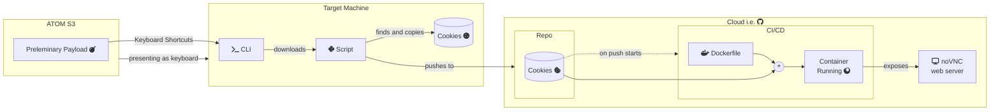

# SSR

```mermaid
flowchart LR
    subgraph TM[Target Machine]
        direction TB
        cli[fa:fa-terminal CLI]-->|downloads|s[fab:fa-python Script]
        s --> |finds and copies| DB
        DB[(Cookies fa:fa-cookie)]
    end
    subgraph D[ATOM S3]
        direction TB
        PP[Preleminary Payload fa:fa-bomb]
    end
    subgraph C[Cloud i.e. fab:fa-github]
        direction LR
        subgraph CICD[CI/CD]
            direction TB
            dcfile[fab:fa-docker Dockerfile ] --> plus((+))
            plus --> cont[Container\nRunning fab:fa-firefox]
        end
        subgraph Repo
            direction TB
            DB_cp[(Cookies fa:fa-cookie-bite)]
        end
        DB_cp --> plus
        DB_cp -...-> |on push starts| CICD
        cont --> |exposes| noVNC[fa:fa-display noVNC\nweb server]
    end
    D --> |presenting as keyboard| TM
    PP-->|Keyboard Shortcuts|cli
    s ---> |pushes to| Repo
```
