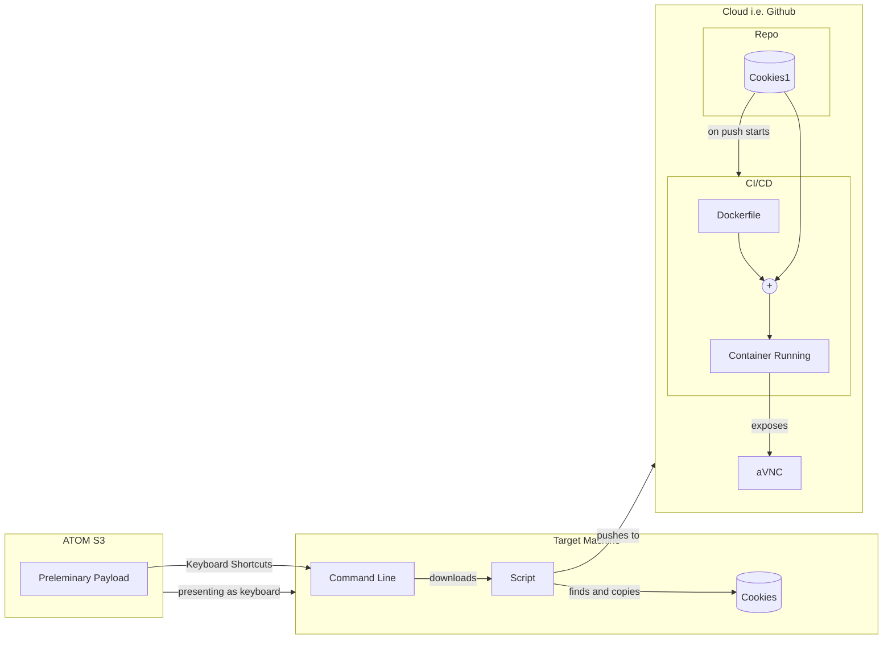

# SSR

```mermaid
flowchart LR
    subgraph TM[Target Machine]
        direction TB
        cli[Command Line]-->|downloads|s[Script]
        s --> |finds and copies| DB
        DB[(Cookies)]
    end
    subgraph D[ATOM S3]
        PP[Preleminary Payload]
    end
    subgraph C[Cloud i.e. Github]
        direction TB
        subgraph CICD[CI/CD]
            dcfile[Dockerfile] --> plus((+))
            plus --> cont[Container Running]
        end
        subgraph Repo
            DB_cp[(Cookies1)]
        end
        DB_cp --> plus
        DB_cp --> |on push starts| CICD
        cont --> |exposes| aVNC
    end
    D --> |presenting as keyboard| TM
    PP-->|Keyboard Shortcuts|cli
    s --> |pushes to| C
```
